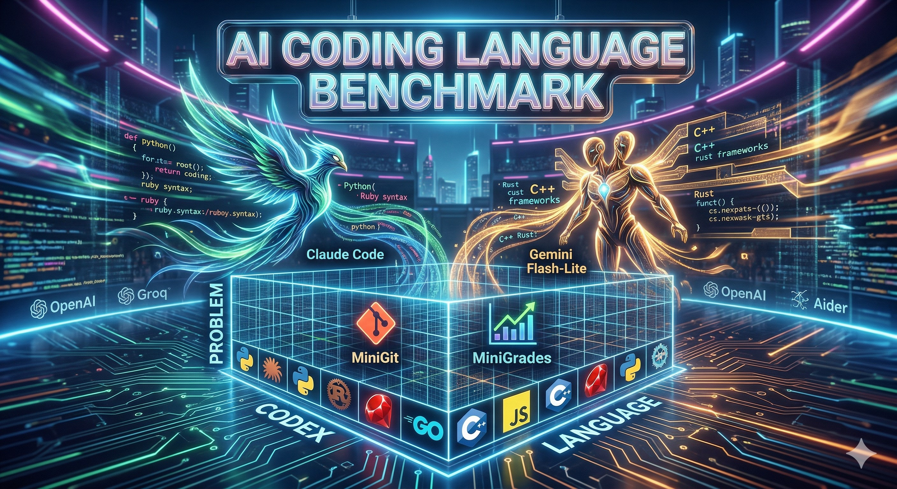

<div align="center">
  

  # 🚀 The AI Native Language Initiative
  
  **AI doesn't just write code—it speaks it. But which language does it speak best?**
  
  [](./AGENT.md)
  [](#-supported-codexes)
  [](#-the-arena-problems)
  
  *We are on a mission to map the "native tongue" of Large Language Models. Join us in benchmarking Claude, Gemini, OpenAI, and more across every programming language known to humanity.*
</div>

---

## 🌟 The Vision

When we ask an AI to build a system from scratch, the language we choose matters. Does an LLM reason better in the strict, typed world of **Rust**, or the dynamic flexibility of **Python**? Does it write better **Ruby** than **Go**? 

This isn't just another benchmarking tool. It's an **exploratory movement** to understand the cognitive alignment between Artificial Intelligence and programming paradigms. We are building the definitive matrix comparing **AI coding systems** (Codexes) against **Programming Languages** through standardized real-world **Problems**.

Be part of the discovery. Help us find the ultimate AI-native programming language.

> 🧠 **Explore Deeper:** Internals → [CLAUDE.md](./CLAUDE.md) · Architecture → [program.md](./program.md) · Roadmap → [plan.md](./plan.md)

---

## ⚡ Quick Start: Join the Arena

You don't need to be an expert to contribute. You can run your first benchmark in less than 2 minutes and join the movement.

### 1️⃣ Gear Up
You'll need `ruby`, toolchains for your target languages, and at least one API key or active tool (Claude CLI, Gemini API, or OpenAI API).

### 2️⃣ Configure Your AI
Create `config/codexes.local.yml` (this will be gitignored to protect your keys):

```yaml
codexes:
  gemini:
    enabled: true
    config:
      api_key: "${GOOGLE_API_KEY}"
```
```bash
export GOOGLE_API_KEY="your-key-here"
```

### 3️⃣ Run Your First Benchmark
Test the waters with a lightning-fast dry run:
```bash
bin/which-language run gemini minigit --dry-run --lang python --trials 1
```
Or unleash the full power for a real benchmark:
```bash
bin/which-language run gemini minigit --lang python --trials 1
```

*Your pristine outputs, including raw data, markdown reports, and gorgeous PNG graphs will be waiting for you in the `artifacts/` directory. You are now officially a benchmark runner!*

**Platform Setup Shortcuts:**
- **Windows**: `.\scripts\install_windows.ps1` (run as Administrator)
- **macOS**: `chmod +x scripts/install_mac.sh && bash scripts/install_mac.sh`

---

## 🧩 The Matrix Model

Think of this initiative as a living, breathing matrix. Every benchmark run is an intersection of three dimensions:

| Dimension | Defined by | Example |
|----------|------------|---------|
| 🎯 **Problem** | `problems/<problem>/problem.json` + assets | `minigit`, `minigrades` |
| 🧠 **Codex** | `lib/codexes/*.rb` + `config/codexes*.yml` | `claude`, `gemini`, `openai` |
| 🗣️ **Language**| `config/languages.yml` | `python`, `rust`, `ruby/steep` |

---

## 📊 Current State of the Matrix

We are constantly expanding our coverage. Here is where the initiative stands today:

### 🧠 Supported Codexes
| Codex | Status | Notes |
|------|:---:|-------|
| **Claude Code** | ✅ | Default CLI adapter |
| **Gemini** | ✅ | API adapter, Flash-Lite/Pro |
| **OpenAI** | ✅ | Responses API, cost accounting |
| **Groq** | ✅ | API adapter, robust parsing |
| **Aider** | 🚧 | CLI adapter, *needs validation* |

*More warriors (DeepSeek, Qwen, Grok, Cline) are entering the arena soon. See [plan.md](./plan.md).*

### 🗣️ Supported Languages
- **Dynamic:** `python`, `ruby`, `javascript`, `perl`, `lua`
- **Static:** `rust`, `go`, `c`, `typescript`, `java`
- **Functional:** `scheme`, `ocaml`, `haskell`
- **Typed Variants:** `python/mypy`, `ruby/steep`

### 🎯 The Arena (Problems)
- 💾 **minigit** — Minimal version control system
- 🎓 **minigrades** — Student grade manager
- 🎵 **miniplaylist** — Playlist management system

---

## 🛠️ Power User Commands

Command the benchmarking pipeline like a pro:

```bash
# 🔥 Full pipeline (benchmark + report + figures)
bin/which-language run gemini minigit --lang python --trials 1

# 🏃 Benchmark only 
bin/which-language benchmark gemini minigit --lang python --trials 1

# ⚔️ Epic Codex Battles (Compare systems head-to-head)
bin/which-language run claude minigit --lang python --trials 3
bin/which-language run gemini minigit --lang python --trials 3
```

---

## 🏆 Hall of Fame

This project thrives on the brilliant minds driving it forward. We celebrate every contribution! Here are the legends who have shaped the initiative:

<div align="center">

| [<br /><sub><b>mame</b></sub>](https://github.com/mame) | [<br /><sub><b>berkevnl</b></sub>](https://github.com/berkevnl) | [<br /><sub><b>Ahmetngz</b></sub>](https://github.com/Ahmetngz) |
| :---: | :---: | :---: |
| 🚀 Visionary | 💻 Core Architect | 💻 Core Architect |

</div>

### Become a Legend
Want your face on the Hall of Fame? See our strict but fair [Contributor Protocol (AGENT.md)](./AGENT.md). We are actively hunting for:
- **Codex Whisperers:** Implement new adapters in `lib/codexes`
- **Data Scientists:** Run benchmarks on your machines and submit results
- **Problem Architects:** Design new, brutal testing scenarios in `problems/`
- **Linguists:** Add support for new programming languages to `config/languages.yml`

---

## 🏗️ Repository Layout

For the curious minds, here is how our engine is built:

```text
.
├── bin/                  # CLI Application binaries (which-language)
├── src/                  # Core application scripts (benchmark, report, plot)
├── problems/             # The arena: problem definitions
├── lib/codexes/          # The minds: codex adapters
├── config/codexes.yml    # Codex configuration layer
├── config/languages.yml  # Languages and toolchain configuration
├── scripts/              # Productivity accelerators (installers)
├── program.md            # Agent entry point 
├── AGENT.md              # Contributor protocol & rules
├── plan.md               # Living iteration roadmap
├── walkthrough.md        # Proof-of-work documentation
├── CLAUDE.md             # Technical internals and secrets
└── artifacts/            # The spoils: benchmark outputs
```

---

## 🏛️ Historical Context

This entire movement was ignited by a single, powerful question: *Which Programming Language Is Best for Claude Code?*

- 📖 [Read the original publication that started it all](https://dev.to/mame/which-programming-language-is-best-for-claude-code-508a)
- 🇯🇵 [Japanese version available here](https://zenn.dev/mametter/articles/3e8580ec034201)

## 🌌 The Multiverse (Similar Projects)
We proudly stand alongside other incredible benchmarking initiatives:
- [AutoCodeBench](https://autocodebench.github.io)
- [LiveCodeBench](https://livecodebench.github.io)
- ***"minibookmark"***-Kullanıcıların web sitelerini isimleriyle kaydedip listeleyebildiği bir phyton uygulaması.
